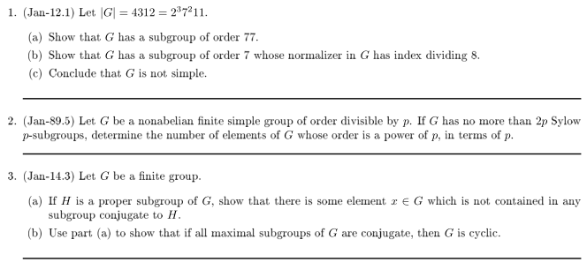
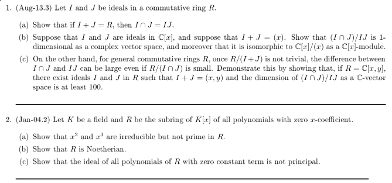

## Groups

## Rings

## Solutions

For groups, see Prob 1 to Prob 3 for the Groups Day 1 handout:

- <https://github.com/coltongrainger/fy19alg1/raw/master/2014_algebra_sep_notes_groups_day_1_solutions.pdf>

For rings, see Prob 1 to Prob 2 for the Rings Day 1 handout:

- <https://github.com/coltongrainger/fy19alg1/raw/master/2014_algebra_sep_notes_rings_day_1_solutions.pdf>
