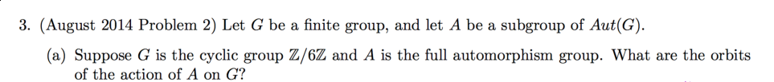

Attempt all 6 problems. From Micky Steinberg's notes on the 2014 Wisconsin Algebra SEP. 

Solutions from Micky, *in color*: <https://www.math.wisc.edu/~micky/grouptheory.pdf> 

{width=2cm}

{width=2cm}

{width=2cm}

{width=2cm}

{width=2cm}

{width=2cm}

<!--
{width=2cm}

-->
