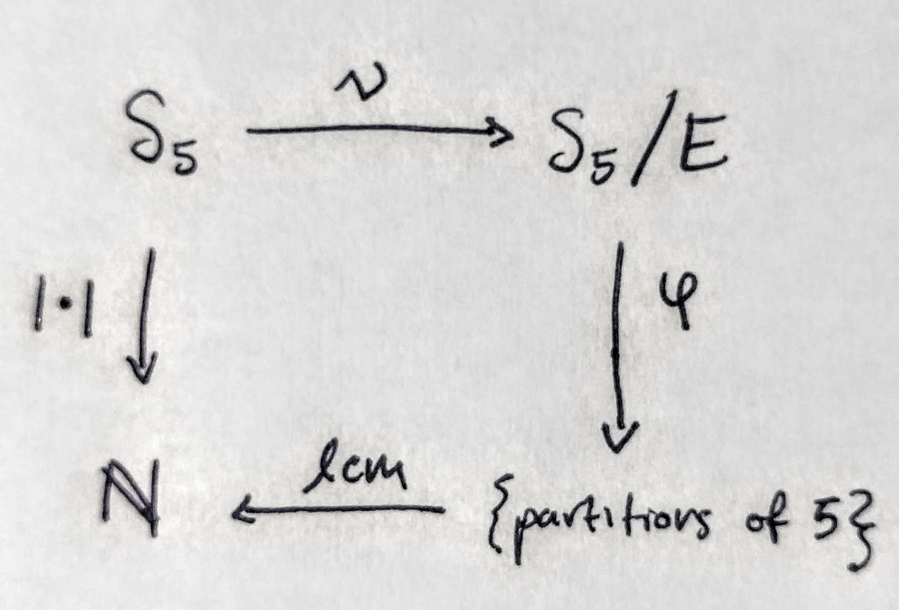

\newcommand{\RR}{\mathbf{R}}
\newcommand{\NN}{\mathbf{N}}
\newcommand{\QQ}{\mathbf{Q}}
\newcommand{\abs}[1]{\left\lvert #1 \right\rvert}
\renewcommand{\phi}{\varphi}

## Assignment due 2018-09-05

### A $\QQ$-vector space with a radical basis [@DF04, number 1.1.8]

Let $G = \left\{a + b\sqrt{2} \in \RR : a,b \in \QQ\right\}$.

(a) Consider $G$ under the binary operation addition. We'll show $G$ is a subgroup of $(\RR, +, 0)$ (and therefore a group itself). 

    - To show $G$ is closed under addition. Consider $a + b \sqrt{2}$ and $c + d \sqrt{2}$ in $G$. Their sum is $(a + c) + (b + d) \sqrt{2}$ by commutativity and associativity[^triv] of the operation $+$ in $\RR$; it's an element of $G$ because $\QQ$ is closed under addition and therefore $a + c, b + d \in \QQ$.
    - To show inverses exist for all elements in $G$. For all $g \in G$, there are $a, b, -a, -b \in \QQ$ such that $g = a + b\sqrt{2}$ and $-g = -a + (-b)\sqrt{2}$. We see $g + (-g) = 0 + 0 \sqrt{2}$, the identity.

    So $G$ is a subgroup of $(\RR, +, 0)$, and therefore a group itself.[^subgroup] 

[^triv]: In future problems the familiar field properties of $\RR$ will go unstated and assumed, unless good exposition calls for the extra detail.
[^subgroup]: Assuming "subgroups are groups" and "a subset of a group is a subgroup iff it's closed under the group operation and taking inverses".

(b) Now consider $G\setminus \{0\} = G^*$ with the binary operation multiplication, i.e., $G^* \leq (\RR, \cdot, 1)$. 

    - To show $G^*$ is closed, let $a + b \sqrt{2}$, $c + d \sqrt{2} \in G^*$. Their product is $(ac + 2bd) + (bc + ad)\sqrt{2}$, meeting the form of membership (atleast one of $ac$, $bd$, $bc$, $ad$ is nonzero) required of $G^*$.
    - To show inverses exist. For any $a + b \sqrt{2} \in G^*$, it's inverse is $$\frac{a-b\sqrt{2}}{a^2 - 2b^2},$$ an element of $G^*$ since $a^2 \neq 2b^2$ (why?)[^believe] and $\QQ$ is closed under addition, multiplication, and inverses.
    
[^believe]: Suppose that $a,b$ are not both zero and $a^2 = 2 b^2$. Then either $(a/b)^2 = 2$ or $(2b/a)^2 = 2$, implying $\sqrt{2} \in \QQ$.

### The dressing-undressing principle [@DF04, number 1.1.15]

Suppose $G$ is a group. Then $(a_1 a_2 \ldots a_n)^{-1} =  a_n^{-1}a_{n-1}^{-1}\ldots a_1^{-1}$ for all $a_1, a_2 \ldots a_n \in G$.

*Proof by induction.* As a base case, for all $a,b \in G$ we verify that $(ab)^{-1} = b^{-1}a^{-1}$ since $abb^{-1}a^{-1} = 1$. For induction on $n$, suppose that $(a_1 a_2 \ldots a_n)^{-1} =  a_n^{-1}a_{n-1}^{-1}\ldots a_1^{-1}$. Now for any $a_{n+1}$, because $(a_1 a_2 \ldots a_n)a_{n+1}a_{n+1}^{-1}(a_1 a_2 \ldots a_n)^{-1} = 1$, we have that $$(a_1 a_2 \ldots a_na_{n+1})^{-1} = a_{n+1}^{-1}a_n^{-1}a_{n-1}^{-1}\ldots a_1^{-1},$$ as desired. \qedsymbol

### Every element its own inverse [@DF04, number 1.1.25]

If $x^2 = 1$ for every element $x$ in the group $G$ then $G$ is abelian.

*Proof.* For any two elements $x$ and $y$ in $G$, consider their product $a = xy$. Because $a \in G$, $$1 = a^2 = xyxy.$$ Now $x^2 = y^2 = 1$ implies $x^{-1} = x$ and $y^{-1} = y$, so from $1 = a^2$ we have $$x1y = xa^2y \iff xy = xxyxxy \iff xy = yx,$$ demonstrating that $G$ is abelian. \qedsymbol

### Direct products of groups [@DF04, number 1.1.28]

Suppose that $(A, \star)$ and $(B, \diamond)$ are groups. We verify that the direct product $A \times B$ satisfies the group axioms.

(a) The binary operation $\cdot \colon (A\times B)\times (A\times B) \to (A\times B)$ is well-defined into $A \times B$. It's associative---one may verify, elementwise, given that the functions $A\times A \to A$ and $B\times B \to B$, respectively, are associative.

(b) The identity $(1_A, 1_B) \in A\times B$ exists and is given by $1_A \in A$ and $1_B \in B$. We check for any $(a,b) \in A \times B$ that $$(1_A, 1_B)(a,b) = (1_A \star a, 1_B\diamond b) = (a, b).$$

(c) Inverses exist for all $(a,b) \in A \times B$, given there's $(a,b)^{-1} = (a^{-1}, b^{-1}) \in A \times B$ such that $(a,b)(a^{-1}, b^{-1}) = (1_A, 1_B)$.

### Abelian groups and their direct products [@DF04, number 1.1.29]

The direct product $A \times B$ is an abelian group if and only if both $A$ and $B$ are abelian.

*Proof.* For any two elements $(a,b), (c,d) \in A \times B$ 
$$(a,b)(c,d) = (c,d)(a,b) \iff ac = ca \text{ and } bd = db$$
for all $a, c \in A$ and for all $b,d \in B$. \qedsymbol

### Dihedral groups of odd regular polygons [@DF04, number 1.2.5]

Suppose $n$ is odd and $n \geq 3$. Then the identity is the only element in the dihedral group $D_{2n}$ that commutes with all elements of $D_{2n}$.

*Proof.* We'll show such an element exists and that it's (uniquely) the identity. Now, by definition, the identity $e$ commutes with all $a \in D_{2n}$. For contradiction, suppose some element $c \neq e$ satisfies $ac = ca \iff c^{-1}a^{-1}ca$ for all elements $a$ as well.

TODO

### Computing permutations [@DF04, number 1.3.1]

Consider the permutations of $S_5$
$$\sigma = \begin{pmatrix} 1 & 2 & 3 & 4 & 5 \\ 3 & 4 & 5 & 2 & 1 \end{pmatrix}, 
\tau = \begin{pmatrix} 1 & 2 & 3 & 4 & 5 \\ 5 & 3 & 2 & 4 & 1 \end{pmatrix}.$$

We have the following cycle decompositions.

element | cycle decomposition
---  | ---
$\sigma$ | (1 3 5)(2 4)
$\tau$ | (1 5)(3 2)
$\sigma^2$ | (1 5 3)
$\sigma\tau$ | (2 5 3 4)
$\tau\sigma$ | (1 2 4 3)
$\tau^2\sigma$ | $\sigma$

### Cycle decompositions in $S_4$ [@DF04, number 1.3.6]

To list the cycle decompositions for all elements in $S_4$ of order $4$. Suppose that $\abs{\sigma}= 4$. Then the least common multiple of the $\abs{\sigma_i}$ in the cycle decomposition $\sigma = \prod\sigma_i$ is $4$ (to be proven below). We proceed to determine the order of each $\sigma_i$. I claim because there's only one partition $4 = \sum k_i$ for positive integers $k_i$ with $\mathrm{lcm}\{k_i\} = 4$, namely the partition $k = 4$, we know $\sigma_i$ must be a $4$-cycle (why?). It follows that the only elements of $S_4$ with order $4$ are $4$-cycles.

How many such $4$-cycles are distinct? Well, there are $4!$ distinct strings of letters (with no letter repeated) from the alphabet of indices $\{i_1 i_2 i_3 i_4\}$. When such strings are considered as $4$-cycles, we recognize that each $4$-cycle has $4$ representations as a string. That is, $$(i_1i_2i_3i_4) = (i_2i_3i_4i_1) = (i_3i_4i_1i_2) = (i_4i_1i_2i_3)$$
so the total number of distinct $4$-cycles in $S_n$ is $4!/4 = 6$. 

We exhaustive enumerate these $6$ distinct $4$-cycles by listing them in lexicographic order: 

- (1 2 3 4)
- (1 2 4 3)
- (1 3 2 4)
- (1 3 4 2)
- (1 4 2 3)
- (1 4 3 2)

### The least common multiple of lengths of disjoint cycles [@DF04, number 1.3.15]

The order of an element in $S_n$ is equal to the least common multiple of the lengths of the cycles in its cycle decomposition. 

*Proof.* We take it for granted that [@Hu74, chapter 1.6]:

> Every nonidentity permutation in $S_n$ is uniquely (up to the order of the factors) a product of disjoint cycles, each of which has length at least $2$.

Now suppose that $\sigma \in S_n$, and write $\sigma = \sigma_1\sigma_2\ldots\sigma_r$ with $\{\sigma_i\}$ disjoint cycles.
Since disjoint cycles commute, $\sigma^m = \sigma_1^m\sigma_2^m\ldots\sigma_r^m$ for all integers $m$. 
Now, the order $\abs{\sigma}$ is defined as the least positive integer $m$ for which $\sigma^m = 1$.
We have $\sigma^m = 1$ if and only if $\sigma_i^m = 1$ for all $i$.
So $\sigma^m = 1$ if and only if $\abs{\sigma_i}$ divides $n$ for all $i$.
Because $m$ is the least such integer, $m = \mathrm{lcm}\{\abs{\sigma_i} \text{ where $\sigma_i$ is a disjoint cycle in the decomposition of $\sigma$}\}$. 
\qedsymbol

### Order of elements in $S_5$ [@DF04, number 1.3.18]

We find all numbers $n$ such that $S_5$ contains an element of order $n$. 

To do so, we will find all the numbers $n$ such that $n = \mathrm{lcm}\left\{a_h \text{ for $a_h$ in a partition $5 = \sum a_h$}\right\}$. 

There's a bijective map $\phi$ from the set of partitions of $5$ to the equivalence classes $S_5/E$ given by the equivalence relation $\sigma E \tau$ if and only if, for the cycle decompositions $$\sigma = \prod\sigma_i \text{ and } \tau = \prod\tau_j, \text{ we have }  \left(\abs{\sigma_{i_1}}, \ldots, \abs{\sigma_{i_m}}\right) = \left(\abs{\tau_{j_1}}, \ldots, \abs{\tau_{j_m}}\right),$$ choosing indices $1 \leq i_k \leq m -1$ so that $\abs{\sigma_{i_{k}}} \geq \abs{\sigma_{i_{k+1}}}$ (and respectively for $\tau_{j_k}$). Informally, $\sigma  E  \tau$ if they have cycle decompositions (for which we commute disjoint cycles to write the largest on the left) where order of the $k$th cycle in each is equal. The bijective map $\phi \colon S_5/E \to \{\text{partitions of }5\}$ associates each equivalence class of disjoint cycles with orders $(a_1, \ldots, a_m)$ to the partition $5 = a_1 + \ldots + a_m$ (verify this is a partition).

Now, the map of an element to its order in the group $S_5$, call it $\abs{\cdot} \colon S_5 \to \NN$, is compatible with the equivalence relation $E$ in the sense that $\sigma E \tau$ implies $\abs{\sigma} = \abs{\tau}$. Because the order is compatible with the equivalence $E$, we can exhaustively describe the order of elements in $S_5$ by computing the order of a representative element in $S_5/E$. Fortunately, given our careful definition of $\phi$, the order of a representative element $a$ in the equivalence class $\overline{a}$ is given by the least common multiple of the image of $\overline{a}$ under $\phi$. That is, the following diagram commutes.

{width=5cm}

We proceed to find the least common multiple of the $a_h$ for all partitions $\sum a_h = 5$. There are $6$ such partitions, 

\begin{align*}
5 &= 5, &\mathrm{lcm}\{5\} = 5\\
  &=4+1, &\mathrm{lcm}\{4,1\} = 4\\
  &=3+2, &\mathrm{lcm}\{3,2\} = 6\\
  &=3+1+1, &\mathrm{lcm}\{3,1,1\} = 3\\
  &=2+1+1+1, &\mathrm{lcm}\{2,1,1,1\} = 2\\
  &=1+1+1+1+1, &\mathrm{lcm}\{1,1,1,1,1\} = 1
\end{align*}

So that $\{1, 2, 3, 4, 5, 6\}$ is the image of $S_5$ under the map $\abs{\cdot}$, i.e., there is an element of order $n$ in $S_5$ for $n = 1,2, \ldots, 6$.

### Hamilton's quaternion group [@DF04, number 1.5.1]

To compute the order of each element in $Q_8 = \{1, -1, i, -i, j, -j, k, -k\}$ we recall Hamilton's fundamental formula [@Ha1866, Ch. II] $$i^2 = j^2 = k^2 = ijk.$$

## References
